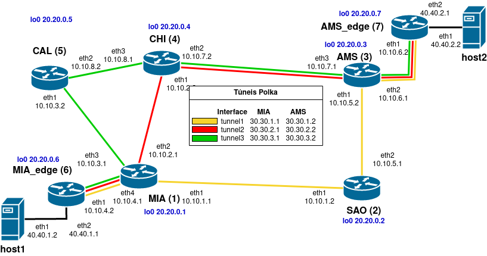

# Arquivos usados para os experimentos do artigo

- \<test1> - arquivos usados no experimento 1
- \<test2> - arquivos usados no experimento 2
- \<test3> - arquivos usados no experimento 3
- controle.sh - script para controlar as máquinas virtuais (iniciar, parar, suspender)
- monitor.sh - script que coleta e mostra as taxas de transferência de todas as máquinas virtuais
- remote.sh - script que executa comandos ou copia arquivos em várias VMs
- topologia.png - topologia usada no artigo
- tunnel.sh - script para trocar o tunnel entre host1 e host2

