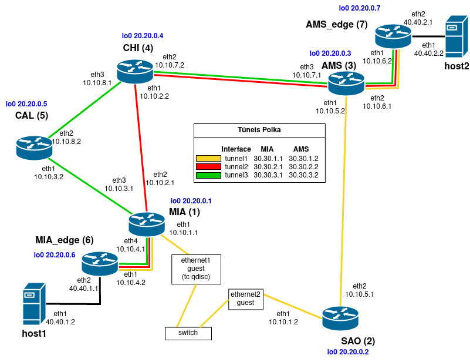

# Arquivos usados no experimento 1

- \<data> - diretório onde são armazenados os dados adquiridos no experimento
- grafico.py - gera gráfico a partir dos dados coletados
- insert_delay.sh - insere um delay na interface ethernet do hospedeiro
- interface_map.txt - mapa das interfaces de rede das máquinas virtuais com as interfaces do freeRtr
- networks.txt - tabela contendo nome da VM, Interface, MAC Address e Nome da rede interna
- template-XXXX-hw.txt - Configuração de software do roteador XXXX
- template-XXXX-sw.txt - Configuração de hardware do roteador XXXX
- test1.png - gráfico com o resultado do experimento
- test1.sh - script que executa o experimento, deve ser executado no host1
- topologia1.png - topologia usada neste experimento, mostra onde foram usadas as interfaces físicas

