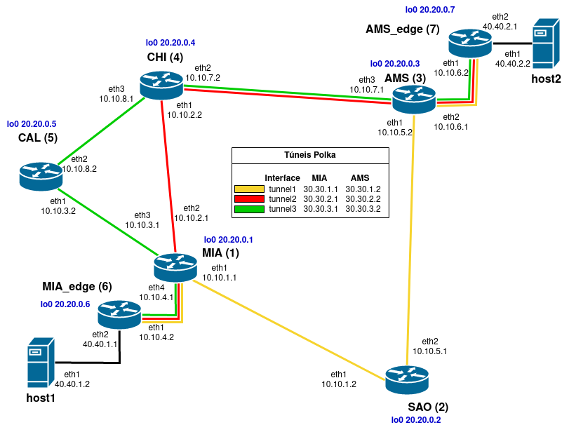

# Arquivos usados no experimento 2

- \<data> - diretório onde são armazenados os dados adquiridos no experimento
- \<result> - diretório onde são gerados os gráficos
- grafico.py - gera gráfico a partir dos dados coletados
- interface_map.txt - mapa das interfaces de rede das máquinas virtuais com as interfaces do freeRtr
- networks.txt - tabela contendo nome da VM, Interface, MAC Address e Nome da rede interna
- template-XXXX-hw.txt - Configuração de software do roteador XXXX
- template-XXXX-sw.txt - Configuração de hardware do roteador XXXX
- test2.png - gráfico com o resultado do experimento
- test2.sh - script que executa o experimento, no host2 './test2.sh rx' e no host1 './test2.sh tx'
- topologia2.png - topologia usada neste experimento

