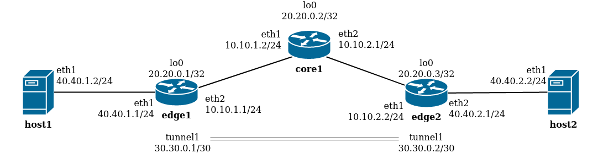

# Arquivos usados na topologia simples para testes

- control_headless.sh - script para controlar as máquinas virtuais (iniciar, parar, suspender)
- interface_map.txt - mapa das interfaces de rede das máquinas virtuais com as interfaces do freeRtr
- monitor.sh - script que coleta e mostra as taxas de transferência de todas as máquinas virtuais
- networks.txt - tabela contendo nome da VM, Interface, MAC Address e Nome da rede interna
- remote.sh - script que executa comandos ou copia arquivos em várias VMs
- simple.png - topologia simples que é implementada com estes arquivos
- template-XXXX-hw.txt - Configuração de software do roteador XXXX
- template-XXXX-sw.txt - Configuração de hardware do roteador XXXX

